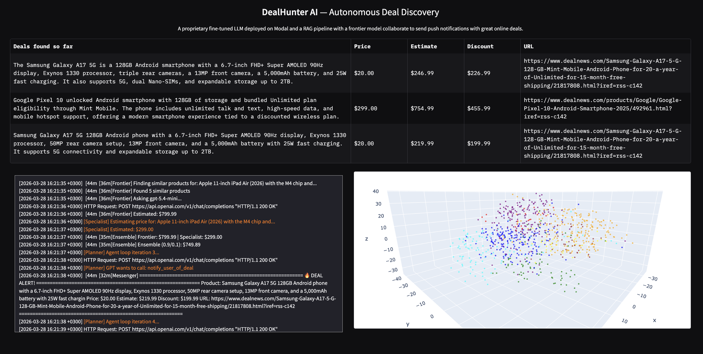

# DealHunter AI — Autonomous Deal Discovery

An autonomous multi-agent AI system that hunts for online deals in real time. It combines a custom fine-tuned LLM deployed as a serverless API, a RAG pipeline backed by 800,000 product embeddings, and a frontier model — all orchestrated by an autonomous planning agent that scans, evaluates, and surfaces the best bargains automatically.



---

## How It Works

DealHunter AI runs a continuous loop every 5 minutes:

1. **ScannerAgent** scrapes live RSS feeds from deal websites, then uses GPT-5.4-mini to curate the top 5 most promising deals with clear prices and detailed descriptions.

2. **EnsembleAgent** estimates the true market value of each product by combining two independent pricing models:
   - **FrontierAgent** — retrieves 5 similar products from a ChromaDB vector store (800K products), feeds them as context to GPT-5.4-mini, and gets an informed price estimate (RAG pipeline).
   - **SpecialistAgent** — a Llama 3.2 (3B) model fine-tuned with QLoRA on product pricing data, deployed as a serverless GPU endpoint on Modal.

3. **PlanningAgent** autonomously orchestrates the entire pipeline using GPT's tool-calling capability. It decides which tools to invoke and in what order — no hardcoded workflow, pure autonomous decision-making.

4. If the deal price is significantly lower than the estimated true value, the agent flags it as a **bargain opportunity** and alerts the user.

---

## Architecture

```
┌─────────────────────────────────────────────────────────┐
│                   PlanningAgent (GPT-5.4-mini)          │
│              Autonomous tool-calling orchestrator       │
└──────────┬──────────────┬───────────────┬───────────────┘
           │              │               │
    ┌──────▼──────┐ ┌─────▼──────┐ ┌──────▼──────┐
    │ ScannerAgent│ │EnsembleAgent│ │MessagingAgent│
    │ RSS + GPT   │ │  90% / 10% │ │   Alerts    │
    └─────────────┘ └──────┬─────┘ └─────────────┘
                           │
                ┌──────────┴──────────┐
                │                     │
         ┌──────▼──────┐      ┌───────▼───────┐
         │FrontierAgent│      │SpecialistAgent│
         │GPT + RAG    │      │Fine-tuned LLM │
         │ (ChromaDB)  │      │   (Modal)     │
         └─────────────┘      └───────────────┘
```

---

## Performance

| Model | MAE ($) |
|-------|---------|
| Base Llama 3.2 (no training) | $84.43 |
| Fine-tuned Llama 3.2 (QLoRA) | $65.40 |
| FrontierAgent — GPT-5.4-mini + RAG (20K products) | $50.67 |
| FrontierAgent — GPT-5.4-mini + RAG (800K products) | $36.65 |
| EnsembleAgent (90/10) | $36.82 |

The FrontierAgent with 800K products in the vector store achieves a **$36.65 mean absolute error**, outperforming a fully fine-tuned Llama 3.2 model trained on the complete dataset.

---

## Tech Stack

- **Fine-tuning**: QLoRA (4-bit quantization + LoRA adapters) on Llama 3.2 (3B)
- **Inference**: Modal (serverless GPU deployment, T4)
- **RAG**: ChromaDB + SentenceTransformers (all-MiniLM-L6-v2)
- **Frontier Model**: OpenAI GPT-5.4-mini
- **Agent Orchestration**: OpenAI tool-calling API
- **Data**: 800,000 Amazon product embeddings across 8 categories
- **UI**: Gradio with Plotly 3D visualization
- **Deal Sources**: DealNews RSS feeds (Electronics, Computers, General)

---

## Project Structure

```
DealHunter-AI/
├── price_is_right.py           # Gradio UI — the main application
├── deal_agent_framework.py     # Orchestrator — manages agents and memory
├── pricer_service.py           # Modal deployment for fine-tuned Llama
├── build_vectorstore.py        # Builds ChromaDB with 800K product embeddings
├── log_utils.py                # Terminal color to HTML converter
├── agents/
│   ├── specialist_agent.py     # Fine-tuned Llama 3.2 on Modal
│   ├── frontier_agent.py       # GPT-5.4-mini + RAG from ChromaDB
│   ├── ensemble_agent.py       # Weighted combination (90/10)
│   ├── scanner_agent.py        # RSS scraper + GPT deal curation
│   ├── messaging_agent.py      # Deal alert notifications
│   ├── planning_agent.py       # Autonomous tool-calling agent
│   └── deals.py                # Data models (Deal, Opportunity, etc.)
```

---

## Setup

### Prerequisites

- Python 3.11+
- OpenAI API key
- HuggingFace account and token
- Modal account

### Installation

```bash
git clone https://github.com/YOUR_USERNAME/DealHunter-AI.git
cd DealHunter-AI
pip install modal openai chromadb sentence-transformers datasets gradio plotly scikit-learn python-dotenv pydantic
```

### Configuration

Create a `.env` file in the project root:

```
OPENAI_API_KEY=your_openai_api_key
```

Set up Modal and add your HuggingFace token as a secret:

```bash
python3 -m modal setup
python3 -m modal secret create huggingface-secret HF_TOKEN=your_hf_token
```

### Deploy the Fine-tuned Model

```bash
python3 -m modal deploy -m pricer_service
```

### Build the Vector Store

This downloads 800K products and computes embeddings. Takes ~45 minutes on CPU.

```bash
python3 build_vectorstore.py
```

### Launch the App

```bash
python3 price_is_right.py
```

The UI opens in your browser. The agent loop starts automatically and re-runs every 5 minutes.

---

## Key Concepts

### QLoRA Fine-tuning
The Specialist model is Llama 3.2 (3B) fine-tuned using QLoRA — 4-bit quantization compresses the model to fit on a single T4 GPU, while LoRA adapters add small trainable matrices (24M parameters, 0.75% of the total) to learn price prediction without modifying the original 3.2B frozen weights.

### RAG (Retrieval Augmented Generation)
The Frontier model doesn't guess prices from general knowledge. For each product, it searches ChromaDB for the 5 most similar products (using vector similarity on 384-dimensional embeddings), retrieves their known prices, and uses that market context to make an informed estimate.

### Autonomous Agent Loop
The PlanningAgent doesn't follow a hardcoded script. GPT receives tool definitions (scan, estimate, notify) and autonomously decides which to call and in what order. The agent loop continues until GPT determines the task is complete.

---

## License

MIT
